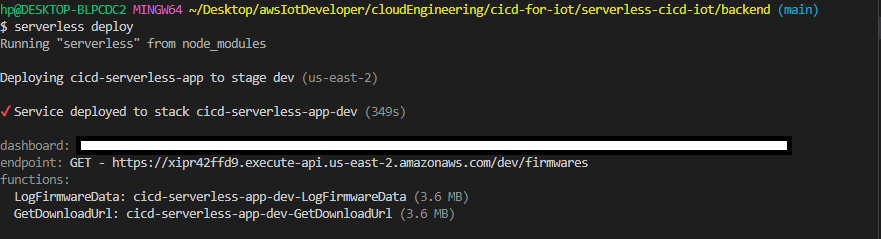

# Serverless CICD and OTA flow for IoT devices with AWS and PlatformIO 

How to build your firmware continuously in the cloud and sent to your devices automatically.

Blog post with details: 

### Install all dependencies

* Clone this repository.
* Run npm install:
    * `npm install`

* Serverless Framework Setup :
  * Create a serverless account at https://app.serverless.com 
  * For this project, Github account was used to sign in.

* AWS Account Setup :
  * Create a AWS account at https://aws.amazon.com  
  * Create an IAM user and retrieve the Secret Access Key and Key ID.

* Github Actions Setup :
  * Create a new repository on Github.
  * Navigate to the main page of the repository and click on settings.
  * In the left sidebar, click Secrets and click New repository secret.
  * Type the secret names has shown in the firmwarebuild.yml and save.

### Deploy lambda Functions

* Navigate into the backend directory.
    * `cd backend`
* For the first time, create an application in your org in Serverless portal:
    * `serverless`
* For subsequent deployments:
    * `serverless deploy`
* Lambda Functions Deployment Output

### Upload firmware with PlatfomIO

I recommend installing the Visual Studio Code (VSCode) IDE and the PlatformIO plugin to get started using it. Just follow the step on the link below: 

https://platformio.org/platformio-ide

To deploy to the board you can use the “Build” and “Upload” buttons on PlatformIO Toolbar.

### References

*  https://dzone.com/articles/how-to-approach-ota-updates-for-iot
* 
* 
* http://docs.platformio.org/en/latest